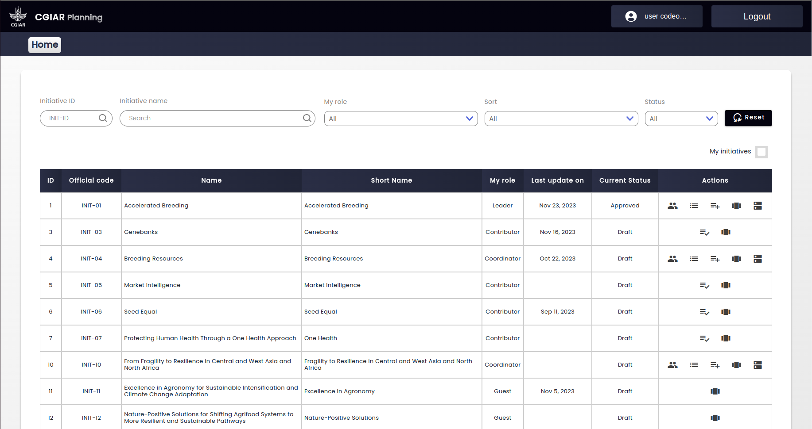

<p align="center">
  
</p>


# CGIAR Planning 

Planning is not inherently a bad thing. CGIAR recognizes that taking and managing planning is an integral part of delivering on its strategy and that effective planning is critical to its success and key element of good governance. Managing planning is an integral part in managing any organization. Good planning is not only about mitigating planning. Good planning is equally about good planning taking.

## Requirements

- Node.js (version >= 16) is installed https://nodejs.org/en
- npm package manager https://docs.npmjs.com/getting-started/what-is-npm

## Configuration

```console
$ cd backend-end
```
```console
$ cp .envExample .env
```
Now open .env file and make changes to the constants that match your server and services 

- CLARISA_USERNAME  https://clarisa.cgiar.org/ username
- CLARISA_PASSWORD  https://clarisa.cgiar.org/ password
- CLARISA_URL  https://clarisa.cgiar.org/  API url 
- DATABASE_HOST database host/ip
- DATABASE_PORT database connection port
- DATABASE_USER database connection user
- DATABASE_PASSWORD database connection password
- DATABASE_NAME database schema name 
- SENDGRID_API_KEY= API Key for sendgrid to send email https://sendgrid.com/
- CAN_SEND_EMAILS To disable (0) and enable (1) sending email recommended (0) for development enviroment 
- DEFAULT_EMAIL Email that all emails sent from 
- Cognito_API AWS Gognito api url https://aws.amazon.com/cognito/
- Gognito_client_id  client_id that provided by AWS Cognito configurations 
- Gognito_client_secret  client_secret that provided by AWS Cognito configurations 
- Gognito_client_redirect_uri  redirect_uri that you provided the AWS Cognito configurations example https://webiste.org/auth
- APP_PORT what port to serve the application backend of default is 3000
- APP_Prefix what base URL you want to serve the backend for example http://localhost:3000/backend default is ( / ) http://localhost:3000
- FRONTEND the frontend URL for example https://webiste.org/ 

```console
$ cd front-end
```

for local machine enviroment 
```console
$  nano /src/environments/environment.local.ts
```

for development enviroment 
```console
$  nano /src/environments/environment.local.ts
```

for production enviroment 
```console
$  nano /src/environments/environment.local.ts
```
    - backend_url The backend URL with the port you previously specified in the backend for example http://localhost:3000 ,
    - socket_path the socket.io path default is /socket.io
    - socket_url: The backend URL with the port you previously specified in the backend for example http://localhost:3000 ,
    - aws_cognito_link:  AWS Cognito link provided by AWS Cognito configurations 
    - aws_cognito_client_id: client_id that provided by AWS Cognito configurations 
    - aws_cognito_client_redirect_uri: redirect_uri that you provided the AWS Cognito configurations example https://webiste.org/auth


## Installation

```console
$ cd front-end
```

```console
$ npm i
```

```console
$ cd back-end
```

```console
$ npm i
```

## Running the app

```bash
$ cd back-end

# development
$ npm run start

# watch mode
$ npm run build-dev

# production mode
$ npm run start:prod
```

```bash
$ cd front-end

# Development watch mode
$ npm run start

# development mode
$ npm run build

# production mode
$ npm run build
```
Then you can serve the dist folder by any server like nginx or apache2

## Documentations 
We are using in the Planning two of the most known frameworks in the nodejs community and we did all the development in a standard way to help any new contributor to contribute right away. Below is the only documentation needed to start 

- Nestjs for backend  https://docs.nestjs.com/

- Angular for frontend https://angular.io/docs

We implemented an OpenAPI Module in Planning to make it easy for frontend developers and other applications to understand easily how to consume the Planning data

You can visit the OpenAPI module at https://api.planning.cgiar.org/ or the root directory of your backend server 

## Authors
The following people have made significant contributions to the technical development of Planning:

- Moayad Al-Najdawi [CodeObia](http://codeobia.com/)
- Monther AlAzhari [CodeObia](http://codeobia.com/)
- Haretha Alsouqi [CodeObia](http://codeobia.com/)
- Tareq anshasi [CodeObia](http://codeobia.com/)
- Mohammad Musa [CodeObia](http://codeobia.com/)
- Yousef Alrahahleh [CodeObia](http://codeobia.com/)
- Rand Awad [CodeObia](http://codeobia.com/)


The following people have made significant contributions to the design and overall function of Planning:

- Saakova, Svetlana (International Center for Agricultural Research in the Dry Areas)
- Adebayo, Atilade Solomon (IITA)
- CATAÑO MORA, Mariafernanda (CIMMYT)
- Ajima, Nancy (One CGIAR)


## License

This work is licensed under the Apache License Version 2.0
